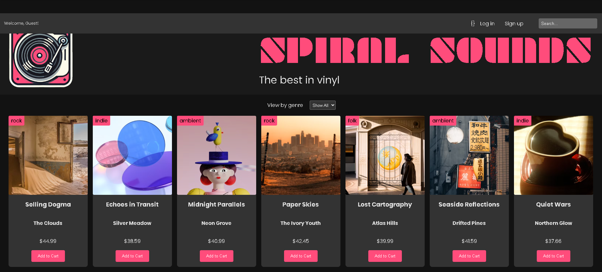

# Spiral Sounds

A full-stack vinyl record store built with Node.js, Express, SQLite, and vanilla JavaScript.

## Features

- User authentication
- Login & Signup
- Session management
- Shopping cart
- Genre filtering
- SQLite database
- Responsive interface

## Technologies

- HTML
- CSS
- JavaScript
- Node.js
- Express
- SQLite

## Installation

Clone the repository

```bash
git clone https://github.com/yapisango/Spiral-Sounds-Auth-Express.git
```

Install dependencies

```bash
npm install
```

Start the server

```bash
npm start
```

Visit

```
http://localhost:8000
```

## Screenshots



## Author

**Sango Yapi**

GitHub:
https://github.com/yapisango